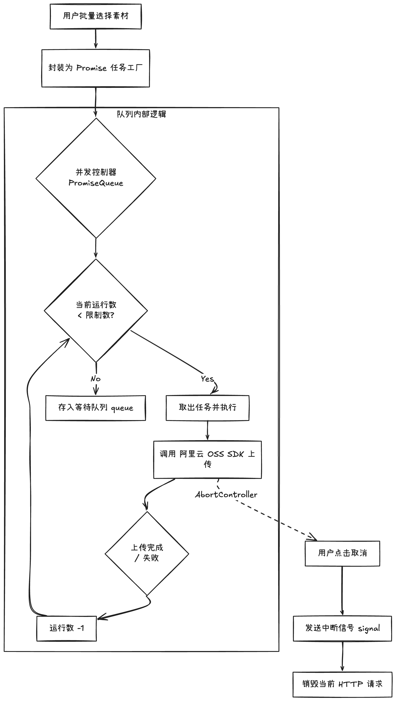

在做后台管理系统时，经常会遇到要传大量素材的情况。

先对齐一个前提：如果单个文件超过 **150MB**，我会走另一套“分片上传”的任务流；而这篇我们要聊的，是针对那种**数量多、单体在 150MB 以内**的素材批量上传场景。

虽然单个文件不算巨大，但如果用户一次性选了几十个文件直接“一股脑”全丢给浏览器处理，后果基本上就是：**页面直接卡死，或者请求大面积超时报错。**

今天不聊分片那种大工程，就实实在在地分享一下我处理“多文件并行”时的两个核心招数：**Promise 并发控制** 和 **AbortController**。

### 1. 为什么不能“一股脑全传”？
以前觉得传文件嘛，循环调用接口不就行了？但真碰到几十个文件同时传，问题就接踵而至：
* **浏览器会“排队”**：Chrome 默认对同一个域名的请求数有限制（一般是 6 个），你一次性发 50 个请求，后面 40 多个就在那死等，挂着挂着就超时了。
* **电脑受不了**：每个上传请求都要占用内存和 CPU，并发一高，浏览器 CPU 蹭地就上去了，用户想点个取消都点不动。
* **想停停不下来**：用户传错了想取消，如果你没做处理，虽然界面显示取消了，但实际上浏览器的网络请求其实还在后台拼命传，白白占用网速。

### 2. 核心方案：搞个“红绿灯”控制并发
我的思路很简单：不管用户选了多少个文件，我每次只允许 **3 到 5 个** 文件同时在传。

**具体是怎么做的：**
我写了一个简单的队列逻辑。把所有待上传的文件先排好队，然后开启几个“窗口”同时工作。
* **传完一个，补一个**：只要有一个文件传成功了，就立刻从队列里再拉下一个进场。
* **保持节奏**：这样浏览器永远只有 3 个活跃请求在跑，既能跑满带宽，又不会让页面卡顿。

### 3. 进阶处理：装个“刹车”随时能取消
多文件上传最怕的就是“想停停不下来”。在上面的逻辑图中可以看到，我引入了 **AbortController** 来给每个请求加个控制开关。

* **精准取消**：每个上传任务都配一个“遥控器”。只要用户点击某个文件的“删除”，我就按一下对应的开关，这个网络请求就立马断开。
* **自动清理**：还有一个细节，就是如果用户还没传完就换到了别的页面，我会在代码里设置自动触发取消。不然人走了，请求还在后台偷偷跑，这太浪费资源了。

### 4. OSS 直传的“外部配合”
因为我们是前端直接对接阿里云 OSS，不走自己的后端服务器，所以虽然省去了后端配置的麻烦，但有两个坑一定要避开：
* **跨域 (CORS) 设置**：OSS 的控制台里必须配置允许我们域名的 `Post` 和 `Put` 请求，否则浏览器会因为安全策略直接拦截上传。
* **STS 临时授权**：前端不直接存密钥。我们每次上传前会调后端接口拿一个分钟级有效的临时凭证（STS），既保证了直传的效率，又守住了安全性。

