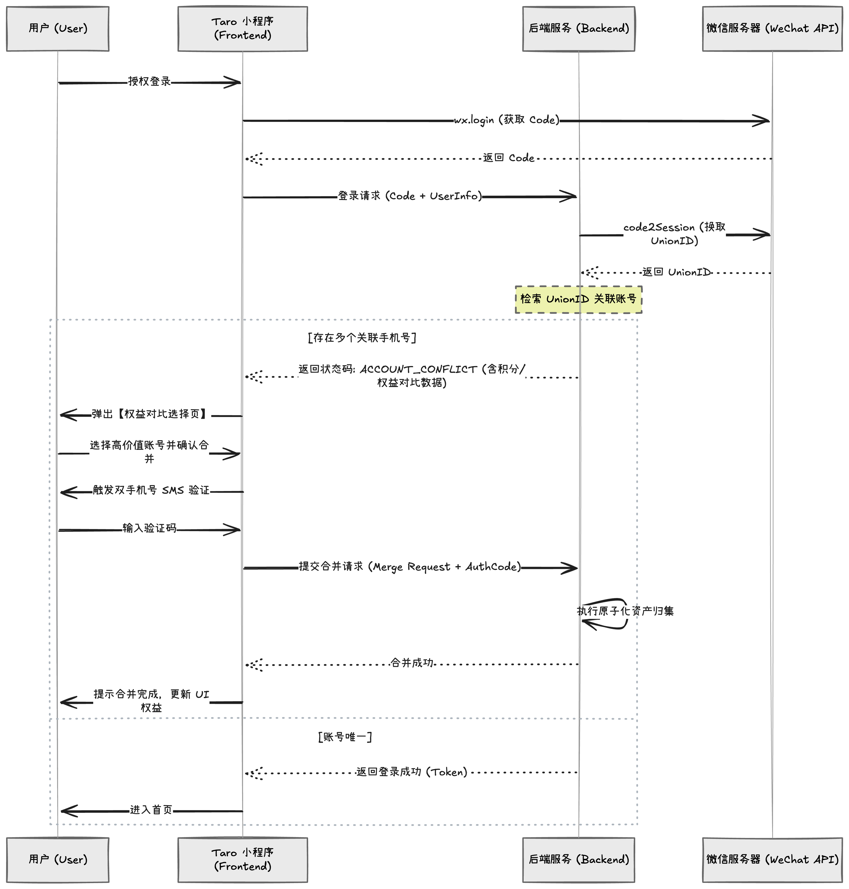

最近在做威马项目的小程序重构，碰到了一个贼头疼的历史遗留问题：**一个微信用户，数据库里居然查出好几个账号。**

起因是早期业务口子开得太多，用户之前可能用 A 手机号登过，后来换了 B 手机号又授权登录了一次。现在搞用户资产统一，积分、会员权益要打通，一查 `UnionID`，好家伙，对不上号了。

没办法，只能在用户登录的必经之路上，加一道**账号合并**的卡点。今天就结合下面这张时序图，聊聊这套逻辑是怎么跑通的。

#### 1. 正常登录触发，顺藤摸瓜找 UnionID

不管怎样，流程的起点都是用户点击“授权登录”。
我们前端用的是 Taro，老规矩，先调 `wx.login` 拿到微信的 `code`，然后连带用户的一些基本信息打包扔给后端。

后端拿到 `code` 后，去微信服务器走 `code2Session` 换取数据，这步最重要的目标只有一个：拿到代表微信用户唯一身份的 **`UnionID`**。

#### 2. 命运的分岔路口：查号拦截

拿到 `UnionID` 之后，后端去数据库里检索关联账号，这时候业务逻辑就开始分岔了：

* **情况 A（皆大欢喜）**：数据库里干净清爽，这个 `UnionID` 只对应一个手机号（账号唯一）。那没啥好说的，后端直接下发 `Token`（返回登录成功），前端拿到后让用户直接进入首页。
* **情况 B（历史包袱）**：存在多个关联手机号。这时候**绝对不能直接让用户登录**。

为了解决情况 B，后端需要给前端返回一个特殊的业务状态码，比如 `ACCOUNT_CONFLICT`（账号冲突），并且把这几个账号的“家底”（积分、权益对比数据）一起扔给前端。

#### 3. 把选择权交给用户：权益对比与合并

前端只要一收到 `ACCOUNT_CONFLICT` 这个状态码，就立马弹出一个【权益对比选择页】。

在这个页面上，用户能直观看到自己过去的几个“分身”。比如：
* 账号一（138xxxx）：5000 积分，level3
* 账号二（139xxxx）：20 积分，level1

傻子都知道要保账号一。所以用户在这个页面上，需要选择一个**高价值账号**并确认合并。

#### 4. 安全第一：双重短信验证

牵扯到资产转移，防人之心不可无。万一别人拿你的旧手机号恶意合并不就完了？
所以在用户点击确认合并后，前端必须触发一步 **SMS 双手机号验证**流程。证明“这几个号确实都是我本人的”。

用户老老实实输入验证码后，前端终于把【合并请求 (Merge Request) + 验证码 (AuthCode)】一起提交给后端。

#### 5. 后端的极限微操：执行原子化资产归集

这步是后端最核心的操作，也就是图里写的：**“执行原子化资产归集”**。

这几个字重如千钧。通俗点说，后端在合并不是简单的数据相加，它涉及多个表的修改（积分表、订单表、卡券表等）。“原子化”的意思是：**要么全部合并成功，要么全部回滚失败。** 绝对不能出现“小号的积分扣了，大号却没加上”这种资损事故。

后端一顿事务操作猛如虎，合并成功后，告诉前端“合并成功”。

#### 6. 功德圆满，进入首页

前端收到合并完成的通知，给用户弹个提示“合并完成，更新 UI 权益”，此时账号已经唯一，后端下发新状态的 Token。

最后，用户带着他满满当当的资产，顺利进入小程序首页。

